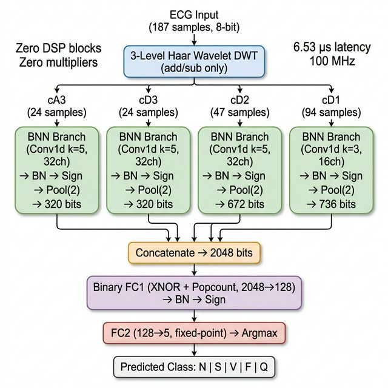
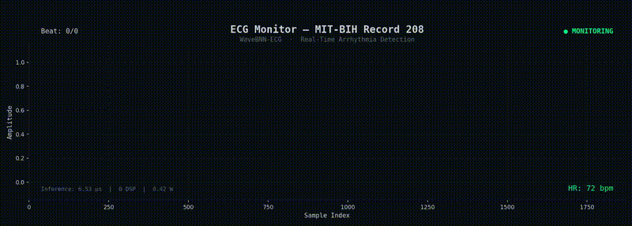

# WaveBNN-ECG: Wavelet + Binary Neural Network for Real-Time ECG Arrhythmia Detection on FPGA

**Zero DSP blocks. Zero multipliers. Sub-microsecond inference. 97.4% accuracy.**

A novel FPGA-accelerated edge AI system that combines **Haar wavelet decomposition** with a **parallel multi-branch Binary Neural Network** to classify ECG heartbeats into 5 AAMI arrhythmia categories — entirely in combinational logic and flip-flops with no hardware multipliers.

---

## Architecture

<p align="center">
  
</p>

## Demo: Real-Time Arrhythmia Detection

<p align="center">
  
</p>

> Real-time ECG classification demo: normal beats (green) and ventricular arrhythmia (red) from MIT-BIH Record 208.

## Key Metrics

| Metric | Value |
|---|---|
| **Accuracy** | 97.4% (MIT-BIH, 5-class AAMI, inter-patient split) |
| **F1 Macro** | 0.878 |
| **Inference latency** | 653 cycles = **6.53 µs** @ 100 MHz |
| **Total on-chip power** | **0.42 W** (junction temp: 29.8°C) |
| **LUT utilization** | 20,465 / 53,200 (38.5%) |
| **Register utilization** | 19,317 / 106,400 (18.2%) |
| **DSP blocks** | **0** (zero hardware multipliers) |
| **BRAM blocks** | **0** |
| **Setup WNS** | +0.786 ns (all timing constraints met) |
| **Target board** | Zynq 7000 ZC702 (xc7z020clg484-1) |
| **Clock** | 200 MHz LVDS → 100 MHz via MMCM |
| **UART baud rate** | 115,200 bps |

## What Makes This Novel

1. **Wavelet frontend is free** — Haar DWT uses only additions and subtractions, zero multipliers
2. **Multi-resolution features** — BNN receives frequency-decomposed sub-bands instead of raw signal
3. **Parallel branch architecture** — 4 BNNs run simultaneously, one per wavelet sub-band
4. **No published FPGA implementation** of wavelet+BNN for ECG exists
5. **Entire inference pipeline uses zero DSP blocks** — pure LUT logic
6. **Deeply pipelined** — 4-stage FC1, 3-stage branches, 2-stage argmax for 100 MHz timing closure

## Dataset

**MIT-BIH Arrhythmia Database** (PhysioNet)

- 48 half-hour ECG recordings, ~110,000 annotated beats
- 5 AAMI classes: Normal (N), Supraventricular (S), Ventricular (V), Fusion (F), Unknown (Q)
- Inter-patient train/test split (no data leakage)
- Download from: [Kaggle Heartbeat Dataset](https://www.kaggle.com/datasets/shayanfazeli/heartbeat)

### Per-Class Performance

| Class | Precision | Recall | F1-Score | Support |
|---|---|---|---|---|
| N (Normal) | 0.983 | 0.990 | 0.986 | 18,118 |
| S (Supraventricular) | 0.796 | 0.700 | 0.745 | 556 |
| V (Ventricular) | 0.939 | 0.915 | 0.927 | 1,448 |
| F (Fusion) | 0.734 | 0.784 | 0.758 | 162 |
| Q (Unknown) | 0.985 | 0.965 | 0.975 | 1,608 |

## Target Hardware

**Zynq 7000 ZC702 Evaluation Board** (xc7z020clg484-1)

- 53,200 LUTs, 106,400 FFs, 140 BRAM, 220 DSP48
- 200 MHz differential LVDS system clock (D18/C19) → 100 MHz via MMCM
- UART via PMOD1 (E15 TX, D15 RX) through TXS0108E level shifter
- 4 user LEDs: heartbeat, busy, done, rx_activity

## Project Structure

```
FPGA_Hack/
├── README.md
├── LICENSE
├── software/                          # Python: training + testing
│   ├── main.py                        # Full pipeline: train → eval → export
│   ├── uart_test.py                   # PC-side UART communication script
│   ├── ecg_animation.py               # ECG monitor animation generator
│   ├── requirements.txt               # Python dependencies
│   ├── src/
│   │   ├── config.py                  # All hyperparameters & paths
│   │   ├── dataset.py                 # MIT-BIH loader + quantization
│   │   ├── wavelet.py                 # Haar DWT (3-level, integer-exact)
│   │   ├── bnn.py                     # WaveBNN model (BinaryConv, BinaryFC)
│   │   └── train.py                   # Training loop + evaluation + export
│   ├── data/                          # MIT-BIH CSV files (not in repo)
│   ├── models/                        # Saved PyTorch checkpoints
│   └── results/                       # Metrics, plots, animation
├── hardware/                          # Verilog: FPGA implementation
│   ├── rtl/
│   │   ├── system_top.v               # Board wrapper (IBUFDS, MMCM, UART, LEDs)
│   │   ├── wavebnn_core.v             # Top-level inference engine FSM
│   │   ├── haar_wavelet_3lvl.v        # 3-level Haar DWT (add/sub only)
│   │   ├── bnn_branch.v               # BNN branch (conv+BN+pool), 3-stage pipeline
│   │   ├── popcount.v                 # Parameterized popcount tree
│   │   ├── bin_fc1.v                  # Binary FC (2048→128), 4-stage pipeline
│   │   ├── fc_output.v                # FC2 (128→5) + 2-stage pipelined argmax
│   │   ├── uart_rx.v                  # UART receiver (115200, 8N1)
│   │   └── uart_tx.v                  # UART transmitter
│   ├── tb/
│   │   ├── tb_wavebnn_core_sv.sv      # Core-level SystemVerilog testbench
│   │   ├── tb_system_top_sv.sv        # System-level testbench (with UART)
│   │   ├── tb_haar_wavelet_3lvl.v     # Wavelet unit testbench
│   │   ├── mmcm_stub.v                # MMCM simulation stub (for Icarus)
│   │   ├── run_core_tb.sh             # Icarus Verilog core TB runner
│   │   ├── run_system_tb.sh           # Icarus Verilog system TB runner
│   │   └── test_vectors/              # Exported .mem files from Python
│   ├── constraints/
│   │   └── zc702.xdc                  # ZC702 pin assignments
│   └── vivado/
│       └── create_project.tcl         # Vivado project creation script
├── docs/
│   ├── architecture.png               # System architecture diagram
│   └── report/                        # IEEE technical report
│       ├── main.tex
│       ├── references.bib
│       └── images/
└──
```

## Quick Start

### Prerequisites

- **Python 3.8+** with pip
- **Vivado 2024.2** (or compatible) with Zynq-7000 device support
- **ZC702 board** + USB-UART adapter (e.g. FTDI FT232R)

### 1. Setup Environment

```bash
git clone https://github.com/StackedArchitect/FPGA_Hack.git
cd FPGA_Hack
python3 -m venv .venv
source .venv/bin/activate
pip install -r software/requirements.txt
```

### 2. Download Dataset

Download the [Kaggle MIT-BIH Heartbeat Dataset](https://www.kaggle.com/datasets/shayanfazeli/heartbeat) and place the CSV files:

```
software/data/mitbih_train.csv
software/data/mitbih_test.csv
```

### 3. Train Model + Export for FPGA

```bash
python software/main.py --epochs 150           # Full pipeline
python software/main.py --eval-only            # Evaluate saved model
python software/main.py --export-only          # Export weights to .mem
```

### 4. Simulate in Vivado

```bash
cd hardware/vivado
vivado -mode batch -source create_project.tcl
```

Then in Vivado GUI:
1. Run **Behavioral Simulation** with `tb_wavebnn_core_sv` (core TB, ~10 tests)
2. Run **Behavioral Simulation** with `tb_system_top_sv` (full system with UART, `run 100ms`)

Or simulate with Icarus Verilog (core TB only):
```bash
cd hardware/tb
bash run_core_tb.sh     # Expected: 10/10 PASSED (653 cycles latency)
```

### 5. Synthesize & Generate Bitstream

In Vivado:
1. **Synthesis** → target: `xc7z020clg484-1`, constraints: `zc702.xdc`
2. **Implementation** → verify timing: WNS ≥ 0
3. **Generate Bitstream** → `runs/impl_1/system_top.bit`

### 6. Program ZC702 Board

1. Connect the ZC702 via JTAG USB
2. In Vivado: **Hardware Manager** → **Open Target** → **Auto Connect** → **Program Device**
3. Select `system_top.bit`

### 7. Run Hardware Test via UART

Connect a USB-UART adapter to **PMOD1 (J62)**:

| PMOD1 Pin | Signal | ZC702 FPGA Pin | Connect To |
|---|---|---|---|
| Pin 1 | FPGA TX out | E15 | Adapter RX |
| Pin 2 | FPGA RX in | D15 | Adapter TX |
| Pin 5 | GND | — | Adapter GND |

```bash
python software/uart_test.py --port /dev/ttyUSB0 --test 10
python software/uart_test.py --port /dev/ttyUSB0 --interactive
```

### LED Indicators

| LED | Signal | Meaning |
|---|---|---|
| LED[0] | Heartbeat | Blinks ~1 Hz when system is running |
| LED[1] | Busy | ON during inference |
| LED[2] | Done | Pulses when classification complete |
| LED[3] | RX Activity | Flashes on UART byte reception |

## RTL Module Details

### Pipeline Architecture

| Module | Pipeline Stages | Critical Path |
|---|---|---|
| `bnn_branch` | 3 (prefetch → accumulate → threshold) | Window registers break pos→mux→acc chain |
| `bin_fc1` | 4 (XNOR → popcount → partial sums → threshold) | Partial-sum registers split 16-way addition |
| `fc_output` | 2 (pairwise compare → final compare) | Argmax comparison tree split across cycles |

### Resource Utilization Breakdown

| Module | LUTs | Registers | Slices |
|---|---|---|---|
| `haar_wavelet_3lvl` | 3,634 | 4,807 | 1,437 |
| `bnn_branch` (cA3) | 1,635 | 1,634 | 838 |
| `bnn_branch` (cD1) | 1,805 | 3,154 | 1,437 |
| `bnn_branch` (cD2) | 2,203 | 2,907 | 1,431 |
| `bnn_branch` (cD3) | 1,769 | 1,654 | 940 |
| `bin_fc1` | 4,748 | 4,582 | 2,060 |
| `fc_output` | 319 | 365 | 141 |
| `uart_rx` | 63 | 34 | 29 |
| `uart_tx` | 27 | 19 | 9 |
| **Total (system_top)** | **20,465** | **19,317** | **7,507** |

## Training Details

| Parameter | Value |
|---|---|
| Optimizer | AdamW (lr=1e-3, weight decay=1e-4) |
| Epochs | 150 |
| Batch size | 256 |
| Binarization | Sign + Straight-Through Estimator (STE) |
| Class weighting | Enabled (handles N >> V >> S > F > Q imbalance) |
| Input quantization | float → int8 (±3σ → ±127) |
| Wavelet | Integer Haar DWT (FPGA bit-exact) |

## ECG Animation

Generate a cinematic ECG monitor animation for presentations:

```bash
python software/ecg_animation.py                  # 10 beats, MP4
python software/ecg_animation.py --beats 15        # More beats
python software/ecg_animation.py --format gif      # GIF for slides
```

## Citation

```bibtex
@misc{wavebnn-ecg-2026,
  title   = {WaveBNN-ECG: Multiplier-Free BNN on FPGA for Real-Time ECG
             Arrhythmia Classification},
  author  = {K.~V.~Sai Ganesh Arvind and Rajamuri Srivardhan Reddy},
  year    = {2026},
  note    = {BITS Pilani -- Hyderabad Campus},
  howpublished = {\url{https://github.com/StackedArchitect/FPGA_Hack}}
}
```

## Team

| Name | Department | Email |
|---|---|---|
| **K. V. Sai Ganesh Arvind** | Electrical and Electronics Engineering | f20220715@hyderabad.bits-pilani.ac.in |
| **Rajamuri Srivardhan Reddy** | Electronics and Communication Engineering | f20220359@hyderabad.bits-pilani.ac.in |

**BITS Pilani — Hyderabad Campus**
